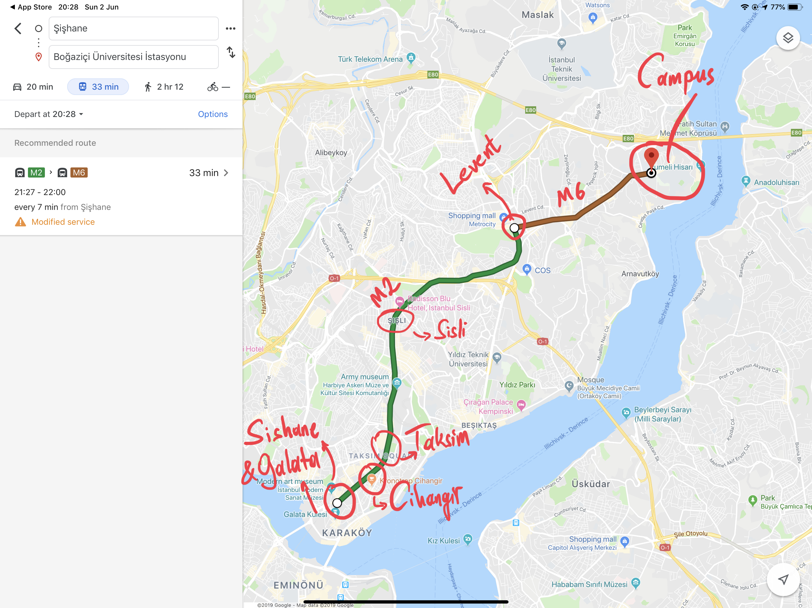
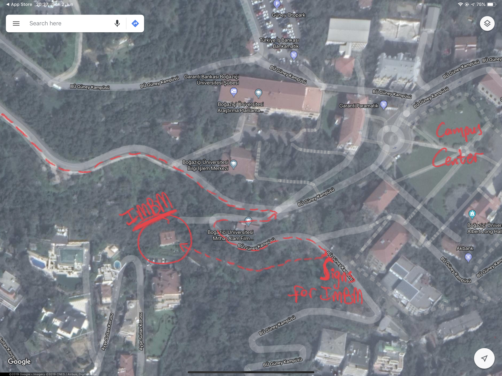

**Workshop on Theoretical Advances in Deep Learning** will take place at the Istanbul Center for Mathematical Sciences ([IMBM](http://www.imbm.org.tr)). The venue is located inside the [Bogazici University](http://www.boun.edu.tr/en_US/Content/About_BU/About_BU) main campus.  

**Dates:** Monday, July 29 - Friday, August 2, 2019   

**Abstract:** During the past few years, differentiable programming as a paradigm of deep learning provided cutting edge applications of machine learning in large scale problems in wide areas covering vision, speech, translation, and various autonomous machines. However, the success rate of working models is much faster than the scientific progress on understanding the working principles of such systems. More recently, theoretical developments shed some light on the inner workings of toy models on simple tasks, yet the community is still missing theoretical results that have strong predictive power on what to expect from large scale models on complex tasks and how to design them to improve their performance. In an attempt to move towards deeper understanding, we aim to bring together a group of researchers interested in the theoretical understanding of deep learning. The workshop is devoted to reviewing the most recent literature to bring everyone at the same level in terms of our current understanding, further, we will discuss theoretical challenges and propose ways to move forward. We will also devote one day of the workshop to interact with the local machine learning community that will include an opportunity for interested advanced students to introduce themselves and we will have a public lecture covering current trends in machine learning.  

Topics will include:  
- Toy models that exhibit characteristic features of large scale systems  
- Scaling laws of neural networks with their degrees of freedom  
- Algorithmic effects and regularization in training neural networks  
- The role of the structure in data and teacher-student networks  
- Limiting behavior of simple models  
- Statistical physics approach to neural networks implications and its limits  
- The role of priors on the performance of models  

**Organizers:** 
- Levent Sagun, EPFL
- Giulio Biroli, ENS
- Matthieu Wyart, EPFL  

**Local Organization Support:**  
- Burcin Unlu, Bogazici University

**Commute to the venue:**  
The subway station next to the campus is [Bogazici Universitesi Istasyonu](https://goo.gl/maps/VrC42pG9vi7u2vpW9). It is the last stop on line M6. Take line M2 (goes through Taksim) and transfer at the station called **Levent** (you can't miss it!).

Commute to Bogazici University South Campus  

Closer look at the South Campus  

Zooming in on IMBM  

